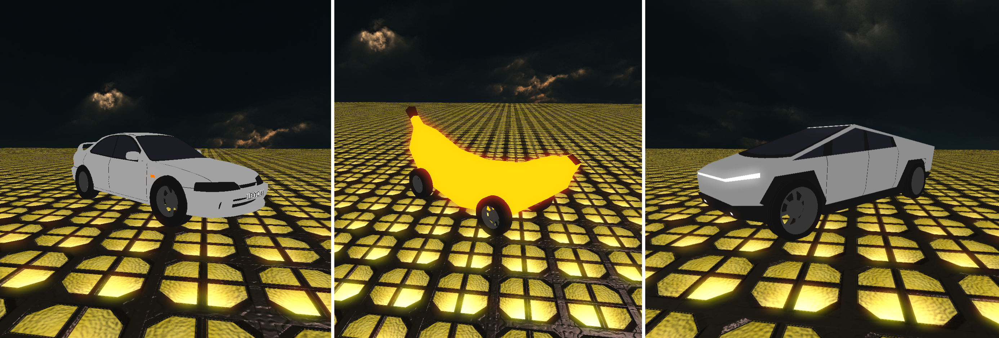

# DrivableVehicles



> A local-only vehicle system for **CastleForge / CastleMiner Z** that adds drivable vehicles, selectable XNB models, configurable controls, optional sounds, and per-vehicle tuning.

---

## What it does

`DrivableVehiclesPrototype` adds a small, buildable starting point for drivable vehicles in CastleMiner Z.

Current features include:

- spawning and entering a drivable vehicle
- `/vehicle` and `/veh` commands
- selectable model folders under `!Mods\DrivableVehicles\Models`
- support for XNB vehicle models in either flat or `models` subfolder layouts
- an internal "Alpha Prototype" fallback vehicle
- configurable driving keys through `DrivableVehicles.clag`
- per-vehicle speed/tuning through `vehicle.clag`
- optional WAV sounds for enter, accelerate, decelerate, and skid/drift
- automatic clean HUD while driving
- blocked held-item actions while driving
- hot reload with `Ctrl+Shift+R` by default

This is still a prototype and is intended as a foundation for future vehicle systems.

> **Note:** The included example vehicle XNBs are currently model-only and do not include finished textures yet. They are mainly included as working conversion examples for testing model loading, controls, sounds, and per-vehicle configs.

---

## Commands

The main command is:

```text
/vehicle
```

Shortcut:

```text
/veh
```

Common workflow:

```text
/veh spawn
/veh enter
/veh exit
/veh clear
```

Model commands:

```text
/veh models
/veh model Truck
/veh model tofu machine
/veh model Alpha Prototype
/veh modeldiag
```

Tuning commands:

```text
/veh scale 10
/veh yawoffset 90
/veh zoffset 0.5
/veh wheelclone on
```

Config and diagnostics:

```text
/veh config
/veh sounds
/veh reload
```

---

## Controls

Default controls are stored in:

```text
!Mods\DrivableVehicles\DrivableVehicles.clag
```

Default keys:

```ini
[Keys]
Enter=R
Exit=R
Forward=W
Left=A
Right=D
Reverse=S
Brake=Space
Reload=R
ReloadRequiresCtrl=true
ReloadRequiresShift=true
ReloadRequiresAlt=false
```

Routine vehicle state feedback can be hidden:

```ini
[Feedback]
VehicleState=false
```

---

## Vehicle folder layout

Each vehicle can live in its own folder:

```text
!Mods\DrivableVehicles\Models\Truck\
```

Recommended layout:

```text
!Mods\DrivableVehicles\Models\Truck\
│   Truck.png
│   vehicle.clag
│
├───models
│       Truck.xnb
│
└───sounds
        unlock.wav
        accel_truck.wav
        deaccelerate.wav
        tire_skidding.wav
```

The older flat layout is also supported:

```text
!Mods\DrivableVehicles\Models\Truck\Truck.xnb
```

If the XNB converter creates sidecar texture XNB files, keep them beside the main model XNB in the same `models` folder.

---

## Per-vehicle config

Each vehicle can have its own:

```text
vehicle.clag
```

Example:

```ini
[Vehicle]
MaxForwardSpeed=18
MaxReverseSpeed=-7
Acceleration=18
BrakeStrength=10
Drag=3.5
SteerRate=2.35

[Sounds]
Enabled=true
Volume=0.75
Enter=sounds\unlock.wav
Accelerate=sounds\accel_truck.wav
Decelerate=sounds\deaccelerate.wav
Skid=sounds\tire_skidding.wav
```

Missing sound files are skipped safely.

---

## Model conversion notes

Vehicle art should be converted to XNB before use.

> **Texture status:** The bundled example XNBs do not currently include finished textures. If you convert your own vehicles, keep any generated sidecar texture `.xnb` files beside the main model `.xnb` in the same `models` folder.

Suggested pipeline:

```text
Unity / Blender / FBX
→ CastleForge FbxToXnb
→ !Mods\DrivableVehicles\Models\<Vehicle>\models\<Vehicle>.xnb
```

If a converted model only imports one wheel mesh, the prototype includes a `wheelclone` workaround that can clone the imported wheel mesh onto missing wheel bones.

---

## Installation

1. Install CastleForge / ModLoader.
2. Build or download the `DrivableVehiclesPrototype` mod.
3. Place the mod DLL in the CastleForge mods folder as required by your setup.
4. Place vehicle XNB models under:

```text
!Mods\DrivableVehicles\Models
```

5. Launch the game and run:

```text
/veh help
```

---

## Compatibility

| Item | Status |
|---|---|
| Game version | CastleMiner Z `1.9.9.8` |
| CastleForge | `0.1.0+` |
| Dependencies | `ModLoaderExtensions` |
| Multiplayer sync | Not implemented |
| Save/load persistence | Not implemented |
| Crafting/placement item | Not implemented |

---

## Prototype limitations

This version is currently local-only and experimental.

Not yet included:

- multiplayer vehicle synchronization
- persistent saved vehicles
- craftable/placeable vehicle items
- full terrain/block collision
- polished physics and suspension

---

## Source and releases

- Source repository: https://github.com/RussDev7/CastleForge-DrivableVehicles
- Releases: https://github.com/RussDev7/CastleForge-DrivableVehicles/releases

---

## Credits

Vehicle assets and sounds are from:

https://github.com/sodiboo/Muck

CastleForge integration, vehicle controls, configuration support, model loading, and CastleMiner Z mod implementation are part of CastleForge-DrivableVehicles.

---

## License

GPL-3.0 license.