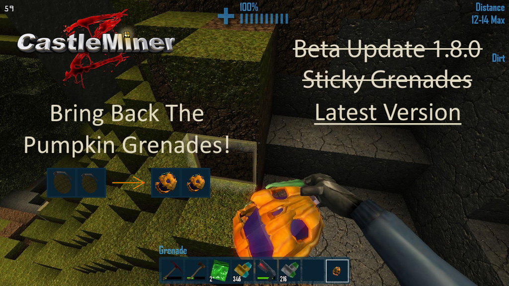

# PumpkinGrenades

> Restores the early CastleMiner Z pumpkin-themed grenade visuals from version 1.8.0 for regular grenades, sticky grenades, and thrown grenade projectiles.



---

## Overview

**PumpkinGrenades** is a small CastleForge ModLoader mod that brings back the old pumpkin-style grenade model used in early CastleMiner Z builds.

In CastleMiner Z `1.8.0`, both the regular grenade and sticky grenade used the pumpkin grenade model from:

```text
Props\Weapons\Conventional\Grenade\Pumpkin\Model
```

Modern builds use the standard grenade model instead. This mod patches the newer game at runtime so the old pumpkin model can be loaded from the mod folder and applied to both inventory/held grenade visuals and thrown grenade projectiles.

---

## Features

| Feature                 | What it does                                                                       |
|-------------------------|------------------------------------------------------------------------------------|
| Pumpkin grenade restore | Loads the old pumpkin grenade `Model.xnb` from the mod asset folder.               |
| Regular grenade support | Applies the pumpkin model to regular grenades.                                     |
| Sticky grenade support  | Applies the same pumpkin model to sticky grenades, matching CastleMiner Z `1.8.0`. |
| Projectile support      | Replaces the thrown grenade projectile model.                                      |
| Icon framing            | Adds UI-only scaling/centering patches for model-rendered inventory icons.         |
| No gameplay changes     | Keeps grenade damage, explosion behavior, recipes, and IDs unchanged.              |

---

## Requirements

- CastleMiner Z
- CastleForge ModLoader
- Pumpkin grenade asset files from an old CastleMiner Z `1.8.0` install or backup

Recommended target:

| Item                | Value        |
|---------------------|--------------|
| Game version        | `1.9.9.8`    |
| CastleForge version | `0.1.0+`     |
| Mod version         | `0.0.1.0`    |
| ModLoaderExtensions | Not required |

---

## Installation

1. Install CastleForge ModLoader.
2. Download/build `PumpkinGrenades.dll` from the mod's release/source repository.
3. Place the DLL in your CastleMiner Z `!Mods` folder.
4. Place the required old pumpkin grenade XNB files in the asset folder shown below.
5. Launch the game and check the ModLoader log for successful patch messages.

Expected layout:

```text
CastleMiner Z\
└─ !Mods\
   ├─ PumpkinGrenades.dll
   └─ PumpkinGrenades\
      └─ Assets\
         ├─ Newpumpkingrenade_0.xnb
         ├─ 1024pumpkingrenadetex2GLOWXTREME_0.xnb
         ├─ PropShader_hidef_0.xnb
         └─ Pumpkin\
            └─ Model.xnb
```

---

## Notes

- Regular grenades and sticky grenades intentionally use the same pumpkin model. That matches the old `1.8.0` behavior.
- The two pumpkin texture XNB files are model material dependencies, not separate regular/sticky grenade skins.
- This is a visual restore mod. It does not change grenade balance, explosion radius, recipes, or networking.
- Players who do not install the mod will see their own local grenade visuals.

---

## Links

- Source: <https://github.com/RussDev7/CastleForge-PumpkinGrenades>
- Releases: <https://github.com/RussDev7/CastleForge-PumpkinGrenades/releases>
