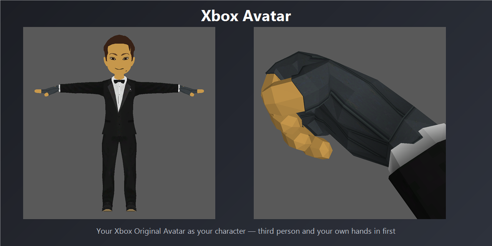

# XboxAvatar

> Your own Xbox Original Avatar as your character in CastleMiner Z, using CastleForge ModLoader.
> Third person for everyone else running the mod, your own hands and glove in first person, and no patched executable.

**Current mod version shown in source:** `1.0.0.0`

---

## Contents

- [Overview](#overview)
- [Why this mod stands out](#why-this-mod-stands-out)
- [Features at a glance](#features-at-a-glance)
- [Requirements](#requirements)
- [Installation](#installation)
- [Quick start](#quick-start)
- [Command reference](#command-reference)
- [Configuration](#configuration)
- [Multiplayer notes](#multiplayer-notes)
- [Technical overview](#technical-overview)
- [Known limitations](#known-limitations)
- [Credits](#credits)

---

## Overview

**XboxAvatar** imports the avatar from the Xbox Original Avatars app and renders
it in place of CastleMiner Z's stock character.

It is a cosmetic and identity mod rather than a gameplay one. Your avatar is the
body other players see, and your own hands and glove are what you see in first
person, driven by the game's existing held-item animation rather than a stand-in
rig.

At its core, the mod:

- captures the assembled avatar model, materials, textures and face layers,
- renders it as the player model with the game's own lighting,
- rebuilds first-person hands from the avatar's own skeleton,
- anchors held items to the avatar's real finger grip,
- and shares avatars between players who have the mod, without disturbing the
  ones who do not.

---

## Why this mod stands out

**Nothing is written to `CastleMinerZ.exe`.** The mod hooks the places it needs
with Harmony and takes its per-frame work from `ModBase.Tick`. A game update
cannot break the install, and there is no backup to restore.

**The first-person hand is your hand.** CastleMiner Z's first-person clips hold
the fingers in a fist that Xbox gloves are not rigged for, so the mod applies
the game's joint rotations to the avatar's own bone offsets - the same
retargeting third person uses. Every fingertip lands within about a millimetre
of where the game's animation puts it, with the glove intact.

**Held items fit the hand that holds them.** The grip point is computed from the
avatar's finger bones, so short, tall, slim and heavy builds all hold a pickaxe
correctly rather than beside the handle.

**Capture never leaves the game.** `/avatar import` starts the capture and loads
the result when it finishes; `/avatar reload` re-reads the file and re-offers it
to everyone in the session.

---

## Features at a glance

- Full avatar rendering: base body, palette and decal passes, facial layers and
  expressions
- First-person hands and glove posed from the avatar's own skeleton, with a
  tunable grip
- Proportion-aware held-item attachment
- World and torch lighting applied to the avatar
- Multiplayer avatar sharing, capability-gated and stock-safe
- Chat commands for capture, reload and tuning
- Hot-reloadable settings file
- Single DLL: Harmony, the importer and the capture bridge are embedded and
  unpacked on first run

---

## Requirements

- Windows
- CastleMiner Z on Steam, `1.9.9.8`
- CastleForge `core-v0.1.0+`
- `ModLoaderExtensions`
- The Xbox Original Avatars app, only if you want to capture an avatar

No game files are included or modified.

---

## Installation

1. Install CastleForge.
2. Put `XboxAvatar.dll` in the game's `!Mods` folder.
3. Start the game. The mod unpacks its importer and capture bridge into
   `!Mods/XboxAvatar/`.

To remove it, delete `XboxAvatar.dll` and the `!Mods/XboxAvatar` folder.

---

## Quick start

1. Open the Xbox Original Avatars app and leave the avatar you want on screen.
2. In game, type `/avatar import`.
3. Confirm the capture.
4. The avatar loads as soon as the importer closes. No restart.

---

## Command reference

| Command | Description |
| --- | --- |
| `/avatar` | Shows the avatar in use, the network message id, and current tuning. |
| `/avatar import` | Captures your Xbox Original Avatar and loads it when the importer closes. |
| `/avatar reload` | Re-reads `avatar.ocavatar` and offers it to everyone in the session. |
| `/avatar grip <0-1>` | How far the first-person hand closes. `1` is the game's own pose, `0` the open hand third person shows. |

---

## Configuration

`!Mods/XboxAvatar/item-tuning.txt`, re-read within a second of saving.

| Setting | Meaning |
| --- | --- |
| `grip 1` | First-person hand closure, `0` to `1`. |
| `hands mesh` | Draw the avatar's own hand and glove. |
| `mode hand` | How the held item is anchored to the avatar. |
| `offset 0 0 0` | Manual nudge for the held item, in metres. |

---

## Multiplayer notes

Avatars are exchanged only with players who also have the mod. A peer advertises
support by appending a marker to a duplicate stock `PlayerExistsMessage`, which
vanilla clients already understand and ignore; the mod strips it before normal
processing. Players without the mod are unaffected and see the stock character.

Transfers are chunked, hash-verified, and served round-robin, so a full lobby
joining at once does not leave the last player waiting through everyone else's
avatar. Received avatars are cached by content hash.

---

## Technical overview

The mod hooks three methods with Harmony - `Player..ctor` to install the avatar
model, `CastleMinerZGame.OnMessage` to consume avatar packets before the stock
dispatcher sees them, and `CastleMinerZGame.OnGamerJoined` to keep a reused
gamer id from inheriting the previous player's avatar. Its per-frame work runs
from `ModBase.Tick`.

Network message ids in this engine are positional, and the table is built before
a mod loader can run. The mod registers itself and rebuilds that table at load;
its packet sorts after every stock type, so stock ids do not move. A peer
advertising a different id is left on the stock character rather than sent
packets its game would misread.

Five tests run on every build: the avatar format and protocol, stock packet ids,
the third-person grip, the first-person hand geometry, and how the mod is
packaged and wired.

---

## Known limitations

- Capture requires the Xbox Original Avatars app. Importing an existing
  `.ocavatar` does not.
- The capture bridge runs as a separate process because it is x64, matching the
  Avatars app, while CastleMiner Z is x86.
- Built and tested against retail `1.9.9.8`.
- Only players running the mod see each other's avatars.

---

## Credits

- Mod and avatar runtime: [KikoTs](https://github.com/KikoTs)
- [CastleForge](https://github.com/RussDev7/CastleForge) by RussDev7, whose
  embedding pattern this mod follows
- Source: <https://github.com/KikoTs/castleforge-xbox-avatar>
- Releases: <https://github.com/KikoTs/castleforge-xbox-avatar/releases>

Licensed GPL-3.0-or-later. The avatar runtime originates in
[openclassic-xbox-avatar](https://github.com/KikoTs/openclassic-xbox-avatar) and
[castleminerz-xbox-avatar](https://github.com/KikoTs/castleminerz-xbox-avatar),
which are MIT, and is included under GPL as MIT permits.

CastleMiner Z, Xbox Original Avatars, Microsoft XNA and their assets remain the
property of their respective owners and are not included.
