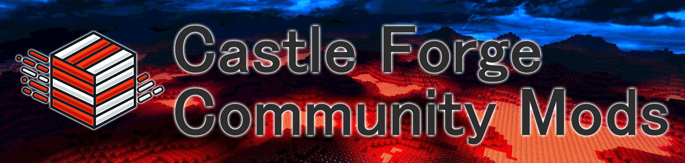

# CastleForge Community Mods



This repository is the **community catalog / hub** for third-party CastleForge content.

It supports three community content types:

- **Mods**
- **Texture Packs**
- **Weapon Addons**

It is intentionally separate from the main CastleForge repository so the core platform and official projects can stay stable, focused, and easy to maintain.

## Browse Community Content Online

Just here to browse?

Visit the live **CastleForge Community Browser**:

➡️ **[Open the Browser](https://russdev7.github.io/CastleForge-CommunityMods/)**

The browser is the easiest way to:

- preview community entries
- open each entry’s README
- jump to source repositories
- find release / download links
- filter by content type

> Use this GitHub repository if you want to **submit**, **edit**, or **maintain** catalog entries.  
> Use the website if you just want to **browse** community content.

## What belongs here

This repository is a good home for:

- third-party CastleForge mods
- community texture packs
- community weapon addons
- preview images / GIFs
- metadata / manifests
- links to source repositories and releases
- compatibility notes

## Recommended model

The best long-term model is:

- each creator keeps their project in its **own repository**
- this repository stores the **catalog entry** for discovery
- each entry links to:
  - source repo
  - releases
  - documentation
  - preview images
  - compatibility metadata

That keeps ownership clear and avoids turning this repository into one giant source monorepo for unrelated community projects.

## Folder layout

```text
CastleForge-CommunityMods/
│  README.md
│  CONTRIBUTING.md
│
├─ Mods/
│  ├─ _template/
│  └─ ExampleCommunityMod/
│     ├─ mod.json
│     ├─ README.md
│     └─ preview.png
│
├─ TexturePacks/
│  └─ _template/
│
├─ WeaponAddons/
│  └─ _template/
│
└─ Index/
   └─ mods.json
```

## Entry manifest shape

Each entry folder uses the same `mod.json` manifest for consistency, even when the entry is a texture pack or a weapon addon.

The required differentiator is:

- `"category": "mod"`
- `"category": "texture-pack"`
- `"category": "weapon-addon"`

That keeps the workflow, validation, and site generation simple while still supporting multiple content families.

## Promotion path

A community entry can later be promoted into the main CastleForge repository if it becomes:

- actively maintained
- widely used
- well documented
- something the CastleForge maintainers want to officially support

## Main CastleForge repo relationship

The main **[CastleForge](https://github.com/RussDev7/CastleForge)** repository is the home of the official CastleForge ecosystem.

Its root README already treats **TexturePacks** and **WeaponAddons** as first-class content systems, alongside the broader modding/tooling ecosystem, so expanding the community catalog to include them is aligned with the main project direction.

### In simple terms

- **CastleForge** = official platform + officially maintained projects
- **CastleForge-CommunityMods** = third-party community catalog

### Why they are separated

Keeping the repositories separate helps:

- keep the main CastleForge repo clean and focused
- make official support boundaries clearer
- avoid mixing unrelated third-party source projects into the core platform
- make community submissions easier to review and organize
- allow community content to grow without bloating the main CastleForge solution

### Support expectations

In general:

- projects in the main **CastleForge** repository are part of the official ecosystem
- entries listed in **CastleForge-CommunityMods** may be community-maintained and may have different update schedules, support levels, or compatibility guarantees

Each catalog entry should make ownership, source links, release links, and compatibility notes as clear as possible.

## Should you add an example texture pack or weapon addon?

Yes, but only in the right way.

**Recommended:**

- keep `_template/` folders for each category
- keep educational sample archives in docs/examples if they help authors learn the format
- add real browser/catalog entries only when they point to an actual public repo and release page

That means public projects like **Minecraft Pack** and **MCDiamondSword** are good fits for real catalog entries once they have a public repository, a clear README, and a stable place to download them from.

---

## Still need help?

If you need help with the community catalog, submission process, or a listed entry, you can reach out here:

- **DM me on Discord:** [dannyruss](https://discordapp.com/users/364835156587970580) (_RussDev7)
- **Join the CastleForge Discord server:** [Discord Server](https://discord.gg/j3PcNJmry5)

> For support with a specific community project, please also check that project's own README, repository, and release page first.
> Community-listed projects may be maintained by independent creators and can have different support levels.

---

## Support CastleForge

Want to support the core CastleForge project that powers the official ecosystem?

[](https://buymeacoffee.com/castleforge)

> This supports the main CastleForge project and its infrastructure. Community-listed projects may be maintained by independent creators.
