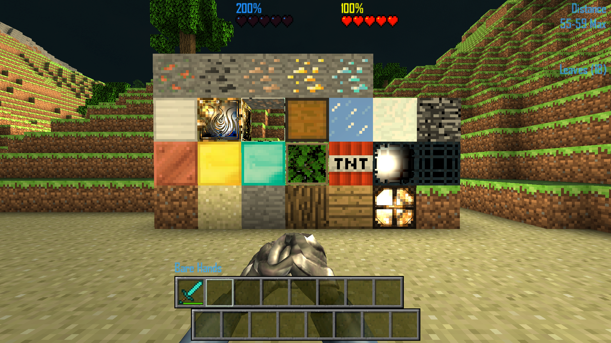

# Minecraft Texture Pack

> A community Minecraft-themed texture pack for CastleForge's **TexturePacks** system.

## Overview

This catalog entry links to RussDev7's Minecraft-inspired CastleMiner Z texture pack project.

It is intended for use with the **TexturePacks** content system and re-styles game visuals with a Minecraft-themed presentation.

## Source repository

- **Source:** https://github.com/RussDev7/CastleForge-Minecraft-TexturePack
- **Releases:** https://github.com/RussDev7/CastleForge-Minecraft-TexturePack/releases

## Included pack folder

The source repository currently contains a pack folder named:

- `Minecraft Pack`

## Installation

1. Install the CastleForge **TexturePacks** framework in your CastleMiner Z setup.
2. Download the pack from the linked repository or its Releases page.
3. Place the pack contents in the location expected by the TexturePacks system.
4. Launch the game with TexturePacks enabled and select or activate the pack.

## Notes

- This is a **community-maintained** listing.
- Compatibility and installation details should follow the source repository and the main **TexturePacks** documentation.
