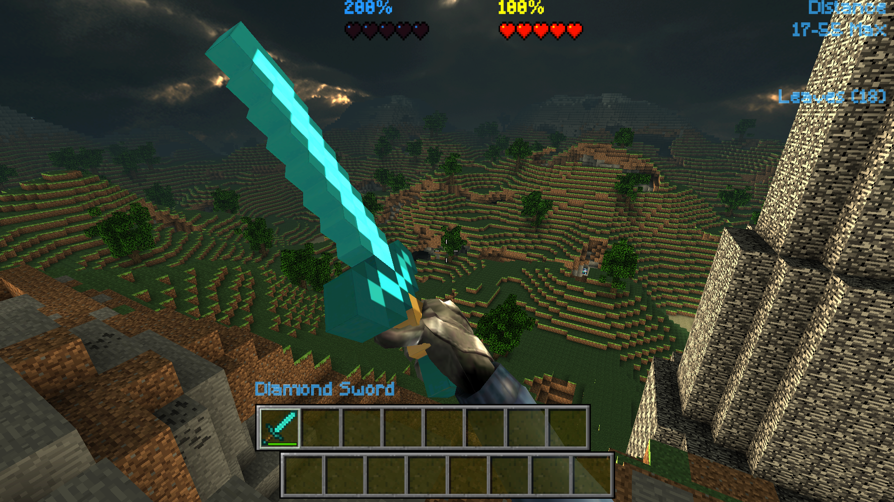

# Minecraft Diamond Sword Addon

> A community Minecraft-themed weapon addon for CastleForge's **WeaponAddons** system.

## Overview

This catalog entry links to RussDev7's Minecraft-inspired diamond sword addon project.

It is intended for use with the **WeaponAddons** content system and provides a custom weapon pack built around a Minecraft-style diamond sword.

## Source repository

- **Source:** https://github.com/RussDev7/CastleForge-Minecraft-DiamondSword-Addon
- **Releases:** https://github.com/RussDev7/CastleForge-Minecraft-DiamondSword-Addon/releases

## Included addon folder

The source repository currently contains an addon folder named:

- `MCDiamondSword`

## Installation

1. Install the CastleForge **WeaponAddons** framework in your CastleMiner Z setup.
2. Download the addon from the linked repository or its Releases page.
3. Place the addon contents in the location expected by the WeaponAddons system.
4. Launch the game with WeaponAddons enabled so the addon can be discovered.

## Notes

- This is a **community-maintained** listing.
- Compatibility and installation details should follow the source repository and the main **WeaponAddons** documentation.
